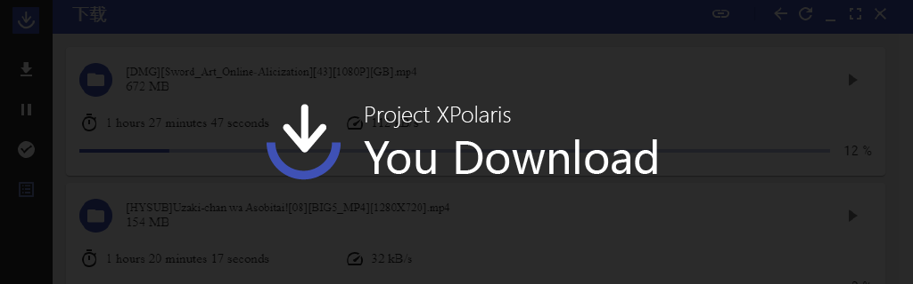

# YouDownload Backend

YouDownaload 是管理下载服务的GUI应用程序，可以方便的管理下载任务。

     

本项目基于[anatasluo/ant](https://github.com/anatasluo/ant)的后端修改而成，需要配合[管理App](https://github.com/Project-XPolaris/YouDownload)来实现。

## Thanks
服务基于以下开源项目的修改或借鉴:
- [anatasluo/ant](https://github.com/anatasluo/ant)
- [anacrolix/torrent](https://github.com/anacrolix/torrent)
